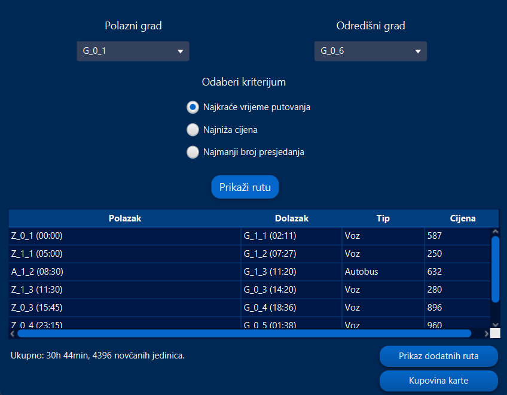
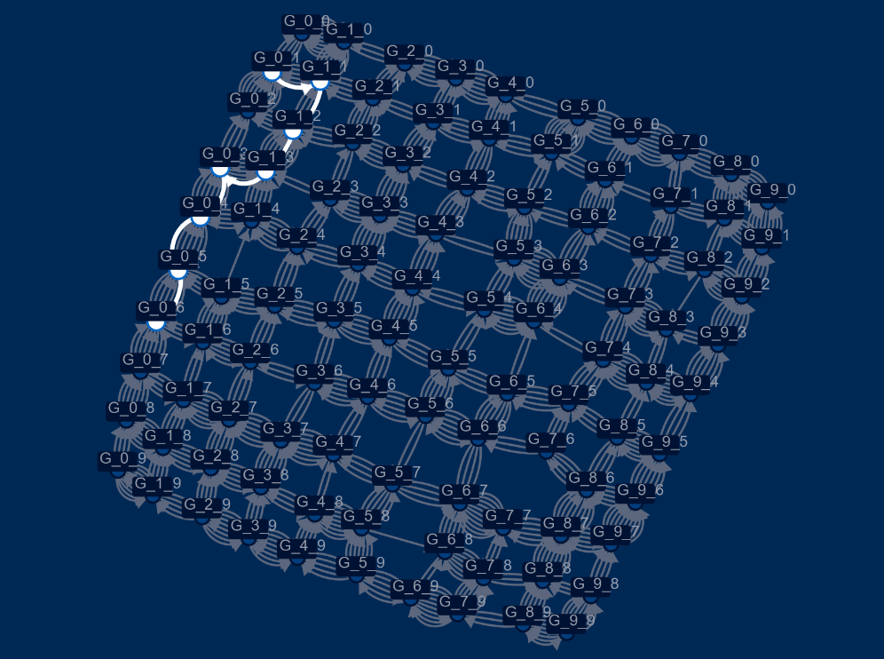
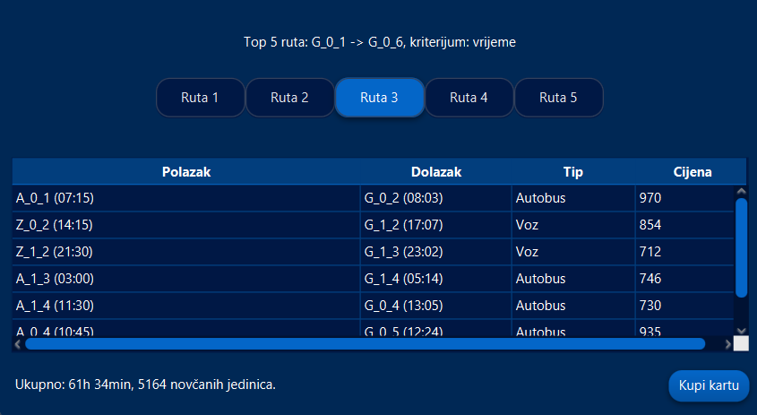

# Multi-Modal Route Planner (JavaFX)

A desktop application that finds the optimal travel route between cities within a simulated country, combining **bus** and **train** transport. Built as a university project for the Software Engineering program at the Faculty of Electrical Engineering, University of Banja Luka (May 2025).

## Overview

The application models a country as an `n × m` grid of cities. Each city has a bus station and a train station, each with its own departure schedule (departure time, arrival time, price, and minimum transfer time). The goal is to compute — and visualize — the best route between any two cities, optimizing for one of three criteria:

- **Shortest travel time**
- **Lowest price**
- **Fewest transfers**

Data (the city grid, stations, and schedules) is procedurally generated and loaded from a JSON file at startup.

## Features

- **Interactive city selection** via combo boxes for origin and destination
- **Three optimization criteria** selectable through radio buttons
- **Route graph visualization** using [GraphStream](https://graphstream-project.org/), with the computed route highlighted on the graph
- **Tabular route breakdown** showing each leg of the journey (departure/arrival times, transport type, price)
- **Top 5 alternative routes** for the selected criterion, each purchasable individually
- **Ticket purchase flow** that generates a text-based receipt, saved locally to a `racuni/` (receipts) folder
- **Running sales stats** (total tickets sold, total revenue) displayed on startup, computed from previously generated receipts
- **Splash screen** and custom-styled UI (CSS)

## Algorithms

Route search is performed over a graph whose nodes are individual **stations** (`A_x_y` for bus stations, `Z_x_y` for train stations) rather than cities, since each station has its own independent schedule.

| Criterion | Algorithm | Notes |
|---|---|---|
| Shortest time | **Dijkstra** (time-weighted) | Weight = earliest possible departure moment from a station; each relaxation picks the next feasible departure, accounting for day rollover and minimum transfer time |
| Lowest price | **Dijkstra** (price-weighted) | Weight = cumulative ticket price along the path |
| Fewest transfers | **BFS** (level-by-level) | Each BFS level = one additional leg; ties within a level are broken by earliest arrival |
| Top 5 routes | **Iterative edge-banning** | Repeatedly finds the best route, removes its edges from the graph, and reruns the relevant algorithm on the filtered graph to find the next-best alternative |

A full written report explaining the algorithm choices is included in the repository (`Izvještaj - Java Projekat.docx`).

## Screenshots

**Route result** — best route for the selected criterion, with total time/price summary:



**Graph visualization** — the full city graph, with the computed route highlighted:



**Top 5 routes** — alternative routes ranked by the chosen criterion, each purchasable:



## Tech Stack

- **Java 21**
- **JavaFX** (Controls, FXML, Swing interop) — GUI
- **GraphStream** (`gs-core`, `gs-ui-javafx`) — graph visualization
- **Jackson** / **Gson** — JSON data parsing
- **Maven** — build and dependency management
- **JUnit 5** — testing

## Project Structure

```
src/main/java/org/example/projekatjava/
├── algorithm/     # DijkstraTime, DijkstraPrice, BFS, Top5Routes, Result
├── data/          # JSON loading (LoadData, JsonLoader, LoadRacuni)
├── generator/     # TransportDataGenerator — procedural data generation
├── graph/         # GraphStream wrapper — graph building, drawing, highlighting
├── model/         # City, Station, BusStation, TrainStation, Country, Departure, Racun
└── ui/            # JavaFX controllers and views (Hello, Top5, Splash, Error)
```

The codebase is organized into packages by responsibility (model / algorithm / data / graph / UI) to keep the route-finding logic decoupled from the GUI, and documented throughout with Javadoc (generated docs included under `/javadoc`).

## Getting Started

### Prerequisites
- JDK 21+
- Maven 3.9+

### Run

```bash
mvn clean javafx:run
```

On first launch, the app generates/loads the transport dataset and displays the splash screen before opening the main window.

### Generating a new dataset

The dataset generator supports custom grid dimensions via its constructor:

```java
TransportDataGenerator generator = new TransportDataGenerator(15, 15); // n x m
TransportData data = generator.generateData();
generator.saveToJson(data, "transport_data.json");
```

## Notes

This was developed as a coursework assignment; the task specification required JavaFX/Swing for the GUI, GraphStream for graph visualization, JSON-based data loading, package-based organization, and Javadoc documentation — all reflected in the structure above.
